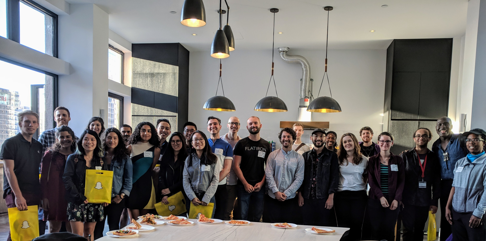
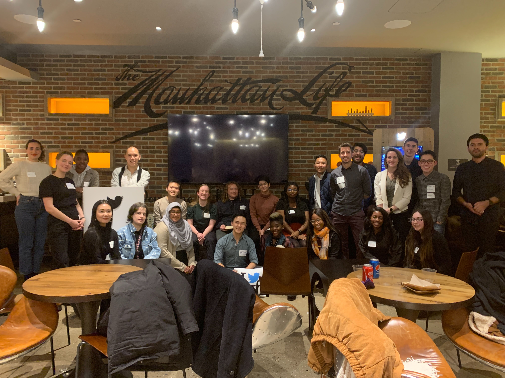
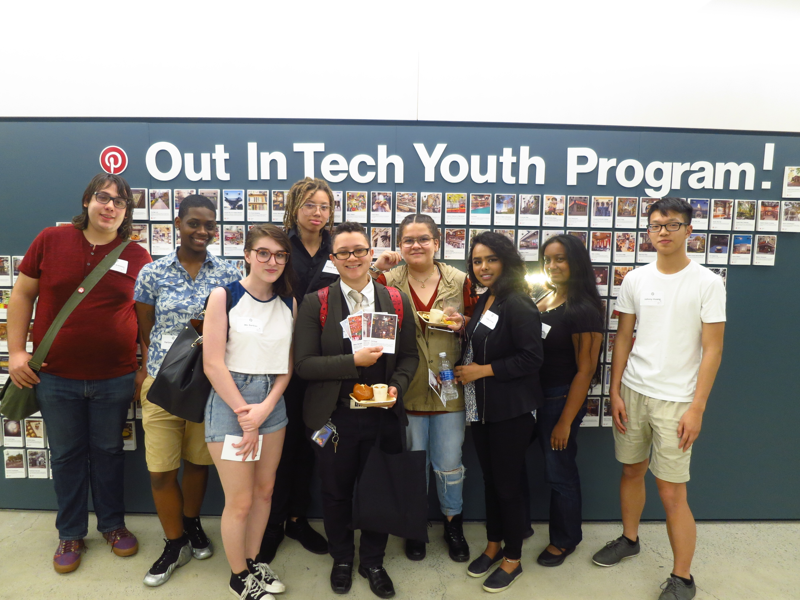
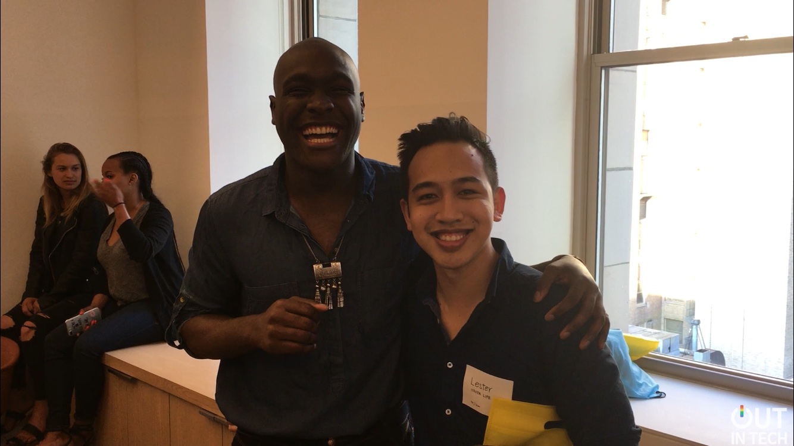

# OutinTech_U_Mentorship_18-19-20

OutinTech_U_Mentorship_18-19-20 repository showcases the hard work mentees have exhibited during their time in the Out in Tech U's Mentorship Program from the 2018, 2019, 2020 cohorts.

Out in Tech U’s Mentorship Program empowers and encourages diversity in the tech world, pairing young adults with like-minded professionals working in the tech sector today. Students can learn first-hand the hard and soft skills needed for launching a successful career.

Through an eight-week-long growth workshop, mentors and mentees work closely together to create fun and inspiring projects, visit cool tech companies, and build lasting relationships based on mutual respect and interests.

Check out the Spring 2020 Out in Tech U’s Mentorship Program Yearbook: https://www.canva.com/design/DAD6rmvVBgY/sUxbPhVC3kVfI117aIAMoA/view?utm_content=DAD6rmvVBgY&utm_campaign=designshare&utm_medium=link&utm_source=viewer

For more information about the Out in Tech U’s Mentorship Program: https://outintech.com/u/mentorship/

